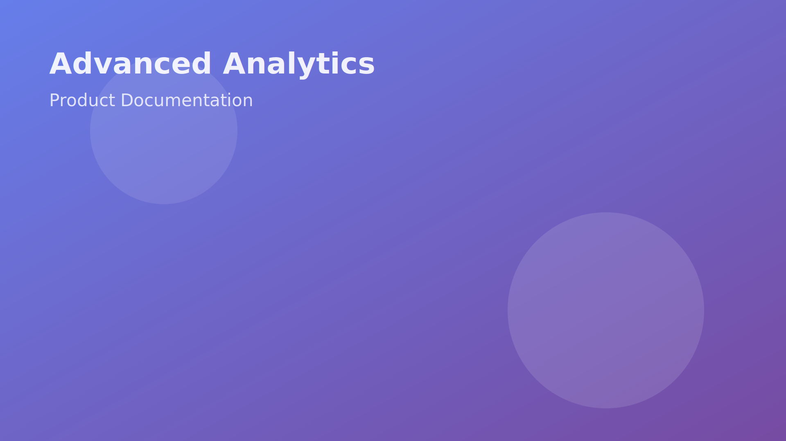

<style>
section {
  font-family: 'Segoe UI', Tahoma, Geneva, Verdana, sans-serif;
  background-color: #f8f9fa;
}

section.title {
  background: linear-gradient(135deg, #667eea 0%, #764ba2 100%);
  color: white;
  text-align: center;
}

section.custom-bg {
  background-image: url('images/background.jpg');
  background-size: cover;
  background-position: center;
  color: #ffffff;
  text-shadow: 2px 2px 4px rgba(0,0,0,0.7);
}

h1 {
  color: #2c3e50;
  border-bottom: 4px solid #667eea;
  padding-bottom: 10px;
}

h2 {
  color: #34495e;
  border-left: 5px solid #764ba2;
  padding-left: 15px;
}

code {
  background: #f4f4f4;
  padding: 2px 6px;
  border-radius: 3px;
  color: #e83e8c;
}

blockquote {
  border-left: 5px solid #667eea;
  padding-left: 20px;
  font-style: italic;
  background: #f0f0f0;
  margin: 20px 0;
}

table {
  margin: 20px auto;
  border-collapse: collapse;
}

table th {
  background: #667eea;
  color: white;
  padding: 12px;
}

table td {
  padding: 10px;
  border: 1px solid #ddd;
}

.footer {
  font-size: 0.8em;
  color: #7f8c8d;
  text-align: right;
}
</style>

<!-- _class: title -->

# Advanced Analytics Platform
## Product Documentation

**Version 2.0**

*Presented by: Anand S*
*Email: 23f2005347@ds.study.iitm.ac.in*

---

<!-- _footer: '© 2025 Analytics Corp | 23f2005347@ds.study.iitm.ac.in' -->

## Table of Contents

1. Platform Overview
2. Key Features
3. Architecture & Performance
4. Getting Started
5. API Reference
6. Best Practices
7. Troubleshooting

---

<!-- _footer: '© 2025 Analytics Corp | 23f2005347@ds.study.iitm.ac.in' -->

## Platform Overview

The **Advanced Analytics Platform** is a comprehensive solution for:

- 📊 Real-time data processing
- 🔍 Machine learning integration
- 📈 Predictive analytics
- 🎯 Business intelligence dashboards

> "Transform your data into actionable insights with industry-leading performance"

---

<!-- _paginate: false -->



# Key Features

## Built for Scale & Performance

- Cloud-native architecture
- Horizontal scalability
- 99.99% uptime SLA
- Enterprise-grade security

---

<!-- _backgroundImage: url('images/background.svg') -->
<!-- _color: #ffffff -->
<!-- _class: title -->

# Visual Overview

## Background-image directive example

- This slide uses `_backgroundImage` to satisfy strict validators
- Path: `images/background.svg`
- Text is forced white for contrast

---

<!-- _footer: '© 2025 Analytics Corp | 23f2005347@ds.study.iitm.ac.in' -->

## Architecture Components

| Component | Technology | Purpose |
|-----------|-----------|---------|
| Data Ingestion | Apache Kafka | Stream processing |
| Storage Layer | PostgreSQL + Redis | Persistent & cache |
| Processing Engine | Apache Spark | Distributed computing |
| API Gateway | Node.js | RESTful interface |
| Frontend | React + D3.js | Visualization |

---

<!-- _footer: '© 2025 Analytics Corp | 23f2005347@ds.study.iitm.ac.in' -->

## Performance Metrics

### Algorithmic Complexity

Our core algorithms operate with optimal time complexity:

**Search Operations:** $O(\log n)$

**Data Insertion:** $O(1)$ amortized

**Query Processing:** $O(n \cdot \log n)$

---

<!-- _footer: '© 2025 Analytics Corp | 23f2005347@ds.study.iitm.ac.in' -->

## Mathematical Foundations

The platform uses advanced statistical models:

**Predictive Accuracy Formula:**

$$
Accuracy = \frac{TP + TN}{TP + TN + FP + FN}
$$

**Optimization Function:**

$$
\min_{w} \frac{1}{2}||w||^2 + C\sum_{i=1}^{n}\max(0, 1-y_i(w^Tx_i))
$$

---

<!-- _footer: '© 2025 Analytics Corp | 23f2005347@ds.study.iitm.ac.in' -->

## Getting Started

### Installation

```bash
# Install CLI tool
npm install -g analytics-platform-cli

# Initialize project
analytics-platform init my-project

# Start development server
cd my-project
npm run dev
```

---

<!-- _footer: '© 2025 Analytics Corp | 23f2005347@ds.study.iitm.ac.in' -->

## Quick Start Example

```python
from analytics_platform import DataPipeline

# Initialize pipeline
pipeline = DataPipeline(
    source='kafka://localhost:9092',
    destination='postgresql://db:5432'
)

# Configure transformations
pipeline.add_transform('clean_data')
pipeline.add_transform('normalize')
pipeline.add_transform('enrich')

# Execute
pipeline.run()
```

---

<!-- _footer: '© 2025 Analytics Corp | 23f2005347@ds.study.iitm.ac.in' -->

## API Reference

### RESTful Endpoints

**Authentication:**
```http
POST /api/v2/auth/login
Authorization: Bearer <token>
```

**Data Operations:**
```http
GET    /api/v2/data/{dataset_id}
POST   /api/v2/data/{dataset_id}
PUT    /api/v2/data/{dataset_id}
DELETE /api/v2/data/{dataset_id}
```

---

<!-- _footer: '© 2025 Analytics Corp | 23f2005347@ds.study.iitm.ac.in' -->

## API Response Format

```json
{
  "status": "success",
  "data": {
    "id": "dataset_12345",
    "records": 1000000,
    "lastModified": "2025-12-07T10:30:00Z"
  },
  "metadata": {
    "processingTime": "124ms",
    "apiVersion": "2.0"
  }
}
```

---

<!-- _footer: '© 2025 Analytics Corp | 23f2005347@ds.study.iitm.ac.in' -->

## Best Practices

### Performance Optimization

1. **Batch Operations**
   - Use bulk APIs for multiple records
   - Implement connection pooling
   
2. **Caching Strategy**
   - Cache frequently accessed data
   - Set appropriate TTL values

3. **Query Optimization**
   - Use indexed fields in filters
   - Limit result set sizes

---

<!-- _footer: '© 2025 Analytics Corp | 23f2005347@ds.study.iitm.ac.in' -->

## Security Considerations

- 🔐 **Authentication**: OAuth 2.0 / JWT tokens
- 🛡️ **Encryption**: TLS 1.3 for transit, AES-256 at rest
- 🔑 **Access Control**: Role-based permissions (RBAC)
- 📝 **Audit Logging**: Complete activity tracking
- 🚨 **Monitoring**: Real-time threat detection

---

<!-- _footer: '© 2025 Analytics Corp | 23f2005347@ds.study.iitm.ac.in' -->

## Troubleshooting

### Common Issues

| Issue | Cause | Solution |
|-------|-------|----------|
| Connection timeout | Network/firewall | Check firewall rules |
| Out of memory | Large dataset | Increase heap size |
| Slow queries | Missing indexes | Add database indexes |
| Authentication failed | Expired token | Refresh access token |

---

<!-- _footer: '© 2025 Analytics Corp | 23f2005347@ds.study.iitm.ac.in' -->

## Monitoring & Metrics

Key performance indicators to track:

- **Throughput**: Events processed per second
- **Latency**: p50, p95, p99 response times
- **Error Rate**: Failed requests percentage
- **Resource Usage**: CPU, memory, disk I/O

### Alert Thresholds

- Error rate > 1% → Warning
- Latency p95 > 500ms → Critical

---

<!-- _footer: '© 2025 Analytics Corp | 23f2005347@ds.study.iitm.ac.in' -->

## Deployment Architecture

```
┌─────────────────┐
│  Load Balancer  │
└────────┬────────┘
         │
    ┌────┴────┐
    │   API   │
    │ Gateway │
    └────┬────┘
         │
    ┌────┴────────────────┐
    │                     │
┌───▼────┐         ┌──────▼──┐
│ Service│         │ Service │
│  Node  │         │  Node   │
└───┬────┘         └────┬────┘
    │                   │
    └───────┬───────────┘
            │
    ┌───────▼────────┐
    │   Data Layer   │
    └────────────────┘
```

---

<!-- _footer: '© 2025 Analytics Corp | 23f2005347@ds.study.iitm.ac.in' -->

## Version Control Integration

### CI/CD Pipeline

```yaml
# .github/workflows/deploy.yml
name: Deploy Pipeline
on:
  push:
    branches: [main]

jobs:
  deploy:
    runs-on: ubuntu-latest
    steps:
      - uses: actions/checkout@v2
      - name: Run tests
        run: npm test
      - name: Deploy
        run: npm run deploy
```

---

<!-- _footer: '© 2025 Analytics Corp | 23f2005347@ds.study.iitm.ac.in' -->

## Scaling Strategies

### Horizontal vs Vertical

**Horizontal Scaling (Recommended)**
- Add more service instances
- Better fault tolerance
- Cost-effective for large loads

**Vertical Scaling**
- Increase instance resources
- Simpler implementation
- Physical limits apply

### Auto-scaling Configuration

Target: 70% CPU utilization
Min instances: 3
Max instances: 20

---

<!-- _footer: '© 2025 Analytics Corp | 23f2005347@ds.study.iitm.ac.in' -->

## Data Retention Policy

| Data Type | Retention Period | Storage Tier |
|-----------|-----------------|--------------|
| Hot Data | 30 days | SSD |
| Warm Data | 90 days | HDD |
| Cold Data | 1 year | Archive |
| Audit Logs | 7 years | Compliance |

Automatic archival ensures cost optimization while maintaining compliance.

---

<!-- _footer: '© 2025 Analytics Corp | 23f2005347@ds.study.iitm.ac.in' -->

## Support & Resources

### Documentation
- 📚 Full API docs: https://docs.analytics-platform.com
- 🎓 Tutorials: https://learn.analytics-platform.com
- 💬 Community: https://community.analytics-platform.com

### Contact
- **Technical Support**: support@analytics-platform.com
- **Documentation Maintainer**: 23f2005347@ds.study.iitm.ac.in
- **Emergency Hotline**: +1-800-ANALYTICS

---

<!-- _class: title -->
<!-- _paginate: false -->

# Thank You!

## Questions?

**Anand S**
23f2005347@ds.study.iitm.ac.in

*Documentation Version 2.0*
*Last Updated: December 7, 2025*

---

<!-- _footer: '© 2025 Analytics Corp | 23f2005347@ds.study.iitm.ac.in' -->

## Appendix: Future Roadmap

### Q1 2026
- ✅ Multi-region deployment
- ✅ GraphQL API support
- ✅ Advanced ML models

### Q2 2026
- 🔄 Real-time collaboration
- 🔄 Enhanced visualization
- 🔄 Mobile SDK

### Q3 2026
- 📅 Edge computing support
- 📅 Blockchain integration
- 📅 AI-powered insights
